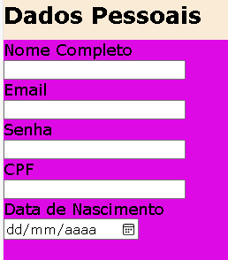
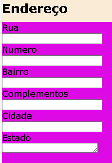

# -form-CadEcommerce-

Esse projeto consciste na criação de um projeto de cadastro para sites ou aplicativos.
## índice
* [Descrição](#descrição)
* [Resultado do projeto](#resultado)
* [Propriedades Ultilizadas](Propriedades)
* [Estilização](estilização)
* [Tecnologias](#tecnologias)
* [Referência](#rêferências)
* [Autor(a)](#autora)

 
 
## Descrição
 
Esse projeto foi criado para uma página de cadastro que simula a realização de cadastro de páginas de e-commerce como: 
* Shoope
* Mercado Livre
* Apple
 
Os projetos que serviram de base para a criação desse projeto, estão disponíveis em: [Formulário de contato](https://github.com/kiaramessias/form-contato) e [Formulário de login](https://github.com/kiaramessias/projeto-login)
## Resultado do projeto
 


 
## Propriedades Ultilizadas
 

 
* background-color - ultilizado para colocar cor no projeto.
 
* font-family - ultilizado para escolher a fonte das letras.
 
* width -  determina a largura da área de conteúdo de um elemento. A área de conteúdo fica dentro do preenchimento, da borda, e da margem de um elemento.
 
* font-weight - define o peso (ou negrito) da fonte.
 
* color - define a cor do texto.

* text-align - define o alinhamento horizontal do conteúdo em nível de linha dentro de um elemento de bloco ou caixa de célula de tabela.

* top- define a posição vertical de um elemento posicionado.

* text-transform - Ela pode ser usada para fazer o texto aparecer todo em letras maiúsculas ou todas em letras minúsculas, ou com cada palavra em letras maiúsculas.

* text-decoration - define a aparência de linhas decorativas no texto.

* background-image - define uma ou mais imagens de fundo em um elemento.

*  position -efine como um elemento é posicionado em um documento.

* padding- define a área de preenchimento em todos os quatro lados de um elemento de uma só vez.

* margin- define a área de margem em todos os quatro lados de um elemento.

* list-style - permite que você defina todas as propriedades de estilo de lista de uma só vez.

* display - define se um elemento é tratado como um bloco ou caixa embutida.

* left - participa da especificação da posição horizontal de um elemento posicionado.

* padding-top - define a altura da área de preenchimento na parte superior de um elemento.

* adding-bottom - define a altura da área de preenchimento na parte inferior de um elemento.

* font - define todas as diferentes propriedades da fonte de um elemento

* align-content - define a distribuição de espaço entre e ao redor dos itens de conteúdo ao longo do eixo transversal de um flexbox ou do eixo de bloco de um elemento de nível de grade ou bloco .

 
 
## Estilização
 
* O projeto foi estilizado ultilizando o arquivo style.css
 
```
*{
    margin: 0;
    padding: 0;
    font-family: Verdana, Geneva, Tahoma, sans-serif;
}
 
nav#menu ul{
    text-transform: uppercase;
    list-style: none;
    position: absolute;
    top: 60px;
    left: 930px;
}
 
.foto img{
    text-align: center;
    background-image: url(https://www.google.com/url?sa=i&url=https%3A%2F%2Fwww.pngwing.com%2Fen%2Ffree-png-psvgc&psig=AOvVaw2C6p6N6YnCfTXmxG7vSVXz&ust=1729079844603000&source=images&cd=vfe&opi=89978449&ved=0CBQQjRxqFwoTCKi8z8KqkIkDFQAAAAAdAAAAABAe);
}
img{
    width: 30%;
    text-align: center;
}

 
.foto{
    text-align: center;
}
nav#menu{
    display: block;
}
 
nav#menu li{
    display: inline-block;
    background-color: rgb(222, 10, 230);
    padding: 10px;
 
}
body{
    background: rgb(222, 10, 230);
   
}
header{
    background-color: antiquewhite;
    padding-top: 70px;
    padding-bottom: 12px;
    position: relative;
}
 
/*Pseudoclasses para estilização de menu de navegação*/
nav#menu a:link{
    text-decoration: none;
    color: antiquewhite;
    font-weight: bold;
}
nav#menu a:visited{
    text-decoration: none;                                                  
    color: antiquewhite;
    font-weight: bold;
}
nav#menu a:hover{
    color: rgb(255, 255, 255);  
}
nav#menu li:hover{
    background-color: rgb(16, 5, 19);
   
}
h2{
    font: size 70px;
}
#frase{
    width: 100%;
    align-content: center;
    text-align: center;
}

 
 
 ```

## Tecnologia
 
* HTML5
* CSS3
* GIT
* Github
* README
 
## Referências
[Mozilla](https://developer.mozilla.org/en-US/docs/Web/CSS/justify-content)
 
## Autor(a)
O projeto foi desenvolvido por:
 
* Kiara Messias

